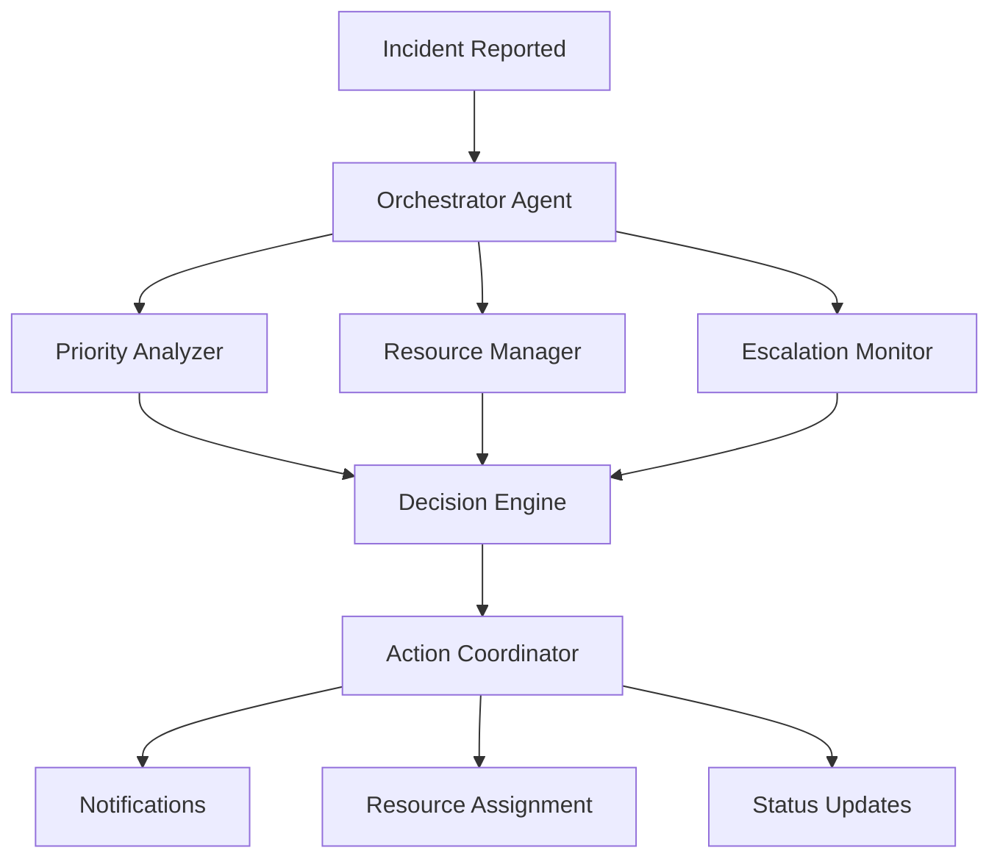

# SafePaw AI Agents System

## Overview
SafePaw uses a multi-agent AI system powered by **Google Gemini** and **Firebase Genkit** to intelligently process dog bite incidents, coordinate responses, and optimize resource allocation.

---

## Architecture



---

## AI Agents

### 1. **Orchestrator Agent** 🎯
**Purpose:** Coordinates all other agents and manages workflow

**Responsibilities:**
- Receives new incident reports
- Distributes tasks to specialized agents
- Aggregates agent responses
- Makes final decisions
- Triggers actions

**Implementation:** `src/services/orchestrator.ts`

```typescript
export async function coordinateMultiAgentResponse(incidentData: any) {
  // Analyze priority
  const priorityAnalysis = await priorityAnalyzer(incidentData);
  
  // Check resources
  const resourceRecommendations = await resourceManager(incidentData);
  
  // Check for escalation
  const escalationStatus = await escalationMonitor(incidentData);
  
  // Combine insights
  return {
    priority: priorityAnalysis.score,
    resources: resourceRecommendations,
    escalation: escalationStatus,
    actions: determineActions(priorityAnalysis, resourceRecommendations, escalationStatus)
  };
}
```

---

### 2. **Priority Analyzer Agent** 📊
**Purpose:** Calculates incident priority using AI-powered analysis

**Factors Analyzed:**
- Severity (Minor/Moderate/Severe)
- Location risk (schools, hospitals, residential areas)
- Time urgency (how old is the incident)
- Historical data (similar incidents in area)
- Victim information (children, elderly)
- Dog behavior (aggressive, rabies concern)

**Priority Score:** 1-10 scale

**Implementation:** `src/agents/priorityAnalyzer.ts`

```typescript
export const priorityAnalyzer = ai.defineFlow(
  {
    name: 'priorityAnalyzer',
    inputSchema: z.object({
      severity: z.enum(['Minor', 'Moderate', 'Severe']),
      location: z.object({
        address: z.string(),
        type: z.string().optional()
      }),
      dogType: z.string(),
      rabiesConcern: z.boolean(),
      childrenAtRisk: z.boolean(),
      repeatOffender: z.boolean()
    }),
    outputSchema: z.object({
      score: z.number(),
      reasoning: z.string(),
      urgency: z.enum(['Low', 'Medium', 'High', 'Critical'])
    })
  },
  async (input) => {
    const prompt = `Analyze this dog bite incident and calculate priority...`;
    
    const { text } = await ai.generate({
      model: gemini15Flash,
      prompt,
      config: { temperature: 0.3 }
    });
    
    return JSON.parse(text);
  }
);
```

**Example Output:**
```json
{
  "score": 8,
  "reasoning": "Severe incident near school with children at risk. Immediate response required.",
  "urgency": "Critical"
}
```

---

### 3. **Resource Manager Agent** 🚑
**Purpose:** Recommends optimal resource allocation

**Resources Managed:**
- Animal control officers
- Veterinary services
- Medical facilities
- Emergency vehicles
- Capture equipment

**Capabilities:**
- Checks availability in real-time
- Considers location proximity
- Estimates response time
- Suggests backup options

**Implementation:** `src/agents/resourceManager.ts`

```typescript
export const resourceManager = ai.defineFlow(
  {
    name: 'resourceManager',
    inputSchema: z.object({
      location: z.object({
        coordinates: z.object({
          latitude: z.number(),
          longitude: z.number()
        })
      }),
      severity: z.string(),
      resourcesNeeded: z.array(z.string())
    }),
    outputSchema: z.object({
      recommendations: z.array(z.object({
        type: z.string(),
        quantity: z.number(),
        estimatedArrival: z.string()
      })),
      alternatives: z.array(z.string())
    })
  },
  async (input) => {
    // Get available resources from Firestore
    const availableResources = await getAvailableResources();
    
    // AI determines best allocation
    const prompt = `Given available resources: ${JSON.stringify(availableResources)}
    And incident details: ${JSON.stringify(input)}
    Recommend optimal resource allocation...`;
    
    const { text } = await ai.generate({
      model: gemini15Flash,
      prompt
    });
    
    return JSON.parse(text);
  }
);
```

**Example Output:**
```json
{
  "recommendations": [
    {
      "type": "Animal Control Officer",
      "quantity": 2,
      "estimatedArrival": "15 minutes"
    },
    {
      "type": "Veterinary Support",
      "quantity": 1,
      "estimatedArrival": "25 minutes"
    }
  ],
  "alternatives": [
    "Nearby police station can provide backup",
    "Mobile vet clinic available in 30 mins"
  ]
}
```

---

### 4. **Escalation Monitor Agent** ⚠️
**Purpose:** Detects incidents requiring escalation

**Escalation Triggers:**
- No action taken for 24+ hours
- Multiple failed response attempts
- High-priority incident ignored
- Resource unavailability
- Repeat incidents in same area

**Actions:**
- Notifies supervisors
- Contacts government agents via SMS/Email
- Updates incident status
- Logs escalation reason

**Implementation:** `src/agents/escalationMonitor.ts`

```typescript
export const escalationMonitor = ai.defineFlow(
  {
    name: 'escalationMonitor',
    inputSchema: z.object({
      incidentId: z.string(),
      status: z.string(),
      createdAt: z.string(),
      lastActionTimestamp: z.string().optional()
    }),
    outputSchema: z.object({
      shouldEscalate: z.boolean(),
      reason: z.string(),
      urgencyLevel: z.enum(['Normal', 'Elevated', 'Critical']),
      recommendedActions: z.array(z.string())
    })
  },
  async (input) => {
    const hoursSinceLastAction = calculateHoursSinceAction(
      new Date(input.lastActionTimestamp || input.createdAt)
    );
    
    const isDelayed = hoursSinceLastAction > 24;
    
    if (isDelayed) {
      return {
        shouldEscalate: true,
        reason: `Incident delayed for ${hoursSinceLastAction} hours without action`,
        urgencyLevel: 'Critical',
        recommendedActions: [
          'Contact government agents immediately',
          'Assign backup resources',
          'Notify supervisor'
        ]
      };
    }
    
    return {
      shouldEscalate: false,
      reason: 'Incident being handled within normal timeframe',
      urgencyLevel: 'Normal',
      recommendedActions: []
    };
  }
);
```

---

### 5. **Real-Time Suggestion Agent** 💡
**Purpose:** Provides instant suggestions while users fill incident reports

**Suggestion Types:**
- Safety alerts
- Priority warnings
- Similar incidents
- Resource recommendations
- Guidance tips

**Implementation:** `src/services/realtimeSuggestions.ts`

**Features:**
- Debounced API calls (500ms)
- Caching (5-minute TTL)
- Rule-based + AI hybrid
- Silent failure (doesn't block form)

**Example Suggestions:**
```json
{
  "suggestions": [
    {
      "type": "safety",
      "priority": "high",
      "title": "⚠️ High-Risk Location",
      "message": "This area is near a school. Extra caution advised.",
      "action": "Consider immediate response"
    },
    {
      "type": "resource",
      "priority": "medium",
      "title": "🚑 Nearby Hospital",
      "message": "Apollo Hospital is 2km away",
      "action": "View on map"
    }
  ]
}
```

---

## AI Technology Stack

### Google Gemini Models

| Model | Use Case | Speed | Cost |
|-------|----------|-------|------|
| **Gemini 1.5 Flash** | Priority analysis, quick decisions | Fast | Low |
| **Gemini 1.5 Pro** | Complex reasoning, multi-step analysis | Medium | Medium |
| **Gemini 2.0 Flash** | Real-time suggestions, chat | Very Fast | Very Low |

### Firebase Genkit Framework

**Benefits:**
- Type-safe AI workflows
- Built-in observability
- Easy testing and debugging
- Seamless Firebase integration
- Production-ready deployment

**Configuration:** `src/index.ts`
```typescript
const ai = genkit({
  plugins: [
    googleAI({
      apiKey: process.env.GOOGLE_AI_API_KEY
    })
  ],
  model: gemini15Flash
});
```

---

## Data Flow

### 1. Incident Submission
```
User submits incident
  ↓
Frontend validation
  ↓
Cloud Function: processIncidentWithAI
  ↓
Orchestrator Agent coordinates
  ↓
Parallel agent execution:
  - Priority Analyzer
  - Resource Manager
  - Escalation Monitor
  ↓
Results aggregated
  ↓
Actions triggered:
  - Firestore update
  - Notifications sent
  - Resources assigned
```

### 2. Real-Time Suggestions
```
User types in form
  ↓
Debounced trigger (500ms)
  ↓
API call: getRealtimeSuggestions
  ↓
Check cache (5min TTL)
  ↓
If cache miss:
  - Rule-based analysis
  - AI enhancement
  - Cache result
  ↓
Return suggestions to UI
  ↓
Display with animations
```

---

## Performance Optimization

### Caching Strategy
```typescript
const suggestionCache = new Map<string, {
  suggestions: AISuggestion[];
  timestamp: number;
}>();

const CACHE_TTL = 5 * 60 * 1000; // 5 minutes

function getCachedSuggestions(key: string) {
  const cached = suggestionCache.get(key);
  if (cached && Date.now() - cached.timestamp < CACHE_TTL) {
    return cached.suggestions;
  }
  return null;
}
```

### Rate Limiting
```typescript
exports.processIncidentWithAI = onRequest(
  {
    cors: true,
    maxInstances: 10,
    rateLimits: {
      maxConcurrentRequests: 30
    }
  },
  async (req, res) => {
    // Process incident
  }
);
```

---

## Monitoring & Observability

### Genkit Tracing
All AI flows are automatically traced:
- Input/output logging
- Execution time
- Error tracking
- Cost monitoring

**View traces:**
```bash
npx genkit start
# Opens UI at http://localhost:4000
```

### Firebase Functions Logs
```bash
firebase functions:log --only processIncidentWithAI
```

### Metrics Tracked
- AI response time
- Cache hit rate
- Escalation frequency
- Resource allocation efficiency
- User satisfaction scores

---

## Testing AI Agents

### Unit Tests
```typescript
describe('Priority Analyzer', () => {
  it('should assign high priority to severe incidents', async () => {
    const result = await priorityAnalyzer({
      severity: 'Severe',
      childrenAtRisk: true,
      rabiesConcern: true
    });
    
    expect(result.score).toBeGreaterThan(7);
    expect(result.urgency).toBe('Critical');
  });
});
```

### Integration Tests
```bash
# Test full workflow
curl -X POST http://localhost:5001/safepaw/us-central1/processIncidentWithAI \
  -H "Content-Type: application/json" \
  -d @test-incident.json
```

---

## Cost Optimization

### API Usage
- **Gemini 1.5 Flash:** $0.075 per 1M input tokens
- **Estimated cost:** ~$0.001 per incident
- **Monthly estimate (1000 incidents):** ~$1

### Optimization Techniques
✅ Use Flash model for simple tasks  
✅ Cache frequent queries  
✅ Batch processing where possible  
✅ Rate limiting to prevent abuse  
✅ Fallback to rule-based logic  

---

## Future AI Enhancements

🔮 **Planned Features:**
- Predictive analytics (incident hotspots)
- Image recognition (dog breed identification)
- Voice-to-text incident reporting
- Multilingual support (Tamil, Hindi, etc.)
- Sentiment analysis of user feedback
- Automated report generation
- Pattern detection for repeat offenders
- Weather-based risk assessment

---

## Best Practices

### For Developers
✅ Always validate AI outputs  
✅ Implement fallback logic  
✅ Monitor API costs  
✅ Test with edge cases  
✅ Keep prompts version-controlled  
✅ Use structured outputs (JSON)  
✅ Handle rate limits gracefully  

### For System Administrators
✅ Monitor AI performance metrics  
✅ Review escalation accuracy  
✅ Adjust thresholds based on data  
✅ Regular model updates  
✅ Cost tracking and budgeting  

---

## API Reference

### Process Incident with AI
```typescript
POST /processIncidentWithAI
{
  "severity": "Severe",
  "location": {
    "address": "Anna Nagar, Chennai",
    "coordinates": { "latitude": 13.0827, "longitude": 80.2707 }
  },
  "dogType": "Stray",
  "description": "Aggressive dog near school"
}

Response:
{
  "success": true,
  "analysis": {
    "priority": 8,
    "urgency": "Critical",
    "resources": [...],
    "actions": [...]
  }
}
```

### Get Real-Time Suggestions
```typescript
POST /getRealtimeSuggestions
{
  "severity": "Moderate",
  "location": "Chennai",
  "rabiesConcern": true
}

Response:
{
  "suggestions": [...],
  "processingTime": 245,
  "cached": false
}
```

---

## Support

For AI-related issues:
- **Documentation:** https://firebase.google.com/docs/genkit
- **Gemini API:** https://ai.google.dev/
- **GitHub Issues:** https://github.com/your-repo/issues
- **Email:** ai-support@safepaw.app
