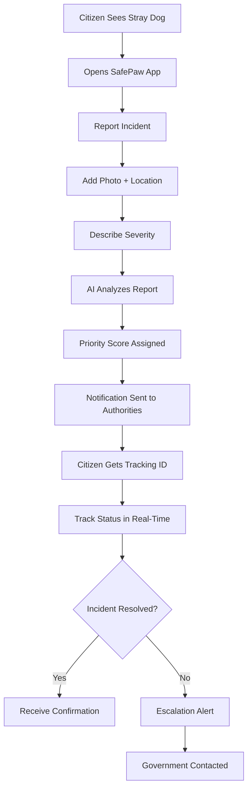
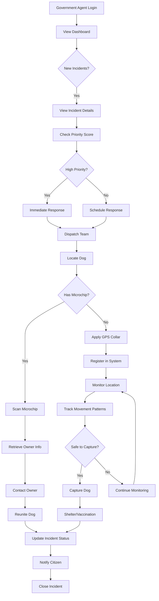
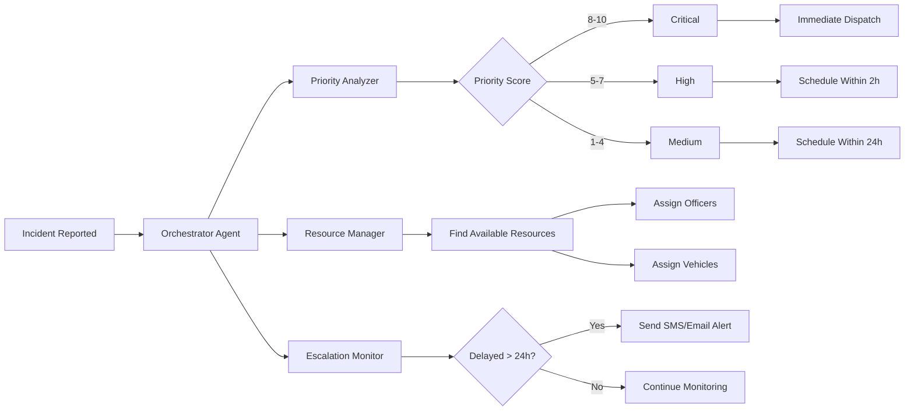
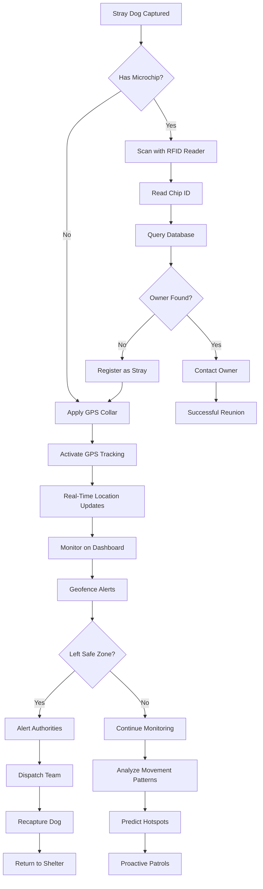
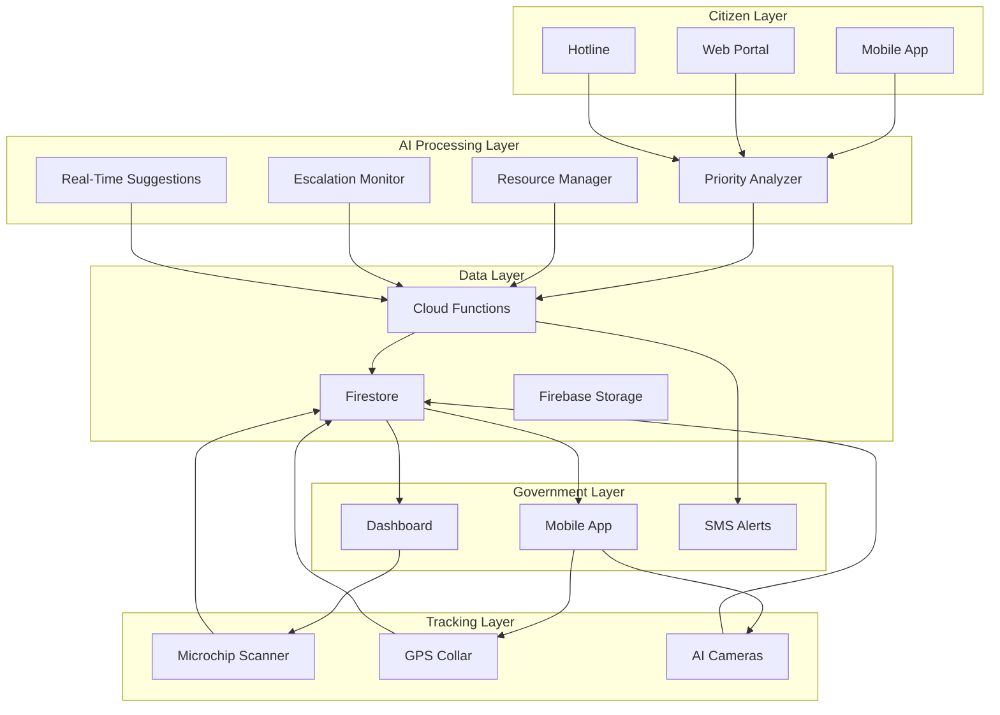
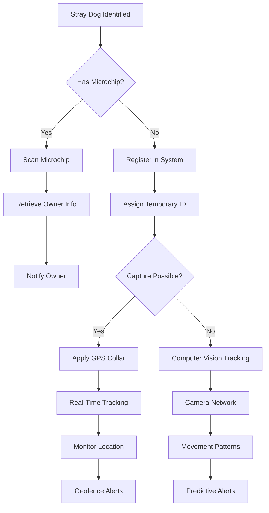

# SafePaw Future Enhancements: Stray Dog Tracking Technology

## Overview
This document outlines future technological enhancements for tracking and monitoring stray dogs to improve public safety and animal welfare. The proposed solutions combine cutting-edge sensor technology, GPS tracking, and AI-powered analytics.

---

## Current Technology Landscape

### Injectable Microchips (RFID)
**Current Standard for Animal Identification**

**Technology:**
- Grain-of-rice sized transponder
- Inserted subcutaneously by veterinarian
- Passive RFID technology
- No battery required

**Capabilities:**
- ✅ Permanent, tamper-proof identification
- ✅ Unique ID number storage
- ✅ Lifetime functionality (15-25 years)
- ✅ Biocompatible materials

**Limitations:**
- ❌ No GPS/location tracking
- ❌ Requires close-range scanner (few inches)
- ❌ No real-time data transmission
- ❌ Read-only functionality

**Use Cases:**
- Lost pet recovery
- Livestock identification
- Wildlife research tracking
- Veterinary medical records

---

## Advanced Injectable Sensors (Research-Level)

### Next-Generation Biosensors

**Capabilities:**
- Heart rate monitoring
- Body temperature tracking
- Activity level detection
- Blood pressure measurement
- Stress hormone detection

**Technology:**
- Micro-electromechanical systems (MEMS)
- Biocompatible encapsulation
- Low-power wireless transmission
- Energy harvesting from body heat

**Limitations:**
- Requires proximity to receiver (10-50 meters)
- Limited battery life (1-3 years)
- High cost ($200-500 per unit)
- Regulatory approval pending

**Example Products:**
- **Whistle GO Explore** (external, but shows capability)
- **FitBark GPS** (wearable health tracker)
- Research prototypes from MIT, Stanford

---

## GPS Tracking Solutions

### Wearable GPS Devices

**Form Factors:**
1. **GPS Collars**
   - Most common for dogs
   - Battery life: 2-7 days
   - Range: Unlimited (cellular/satellite)
   - Cost: $50-300

2. **GPS Harnesses**
   - More secure than collars
   - Integrated with vest/harness
   - Suitable for escape artists

3. **GPS Ear Tags**
   - Used for livestock
   - Larger animals only
   - Long battery life (months)

**Technology Stack:**
- GPS receiver (satellite positioning)
- Cellular modem (4G/5G data transmission)
- Rechargeable lithium battery
- Accelerometer & gyroscope
- Temperature sensor

**Features:**
- ✅ Real-time location tracking
- ✅ Geofencing alerts
- ✅ Activity monitoring
- ✅ Historical route playback
- ✅ Multi-pet tracking
- ✅ Mobile app integration

**Power Requirements:**
- GPS module: 20-50 mA
- Cellular transmission: 100-200 mA (peak)
- Battery capacity: 500-1000 mAh
- Charging: USB-C or wireless

**Leading Products:**
- **Tractive GPS** - $50 + $5/month
- **Fi Smart Collar** - $149 + $99/year
- **Whistle GO Explore** - $130 + $9.95/month
- **Garmin Alpha** - $800 (professional)

---

## Why Injectable GPS Doesn't Exist Yet

### Technical Challenges

#### 1. **Power Constraints**
```
GPS Power Consumption:
- Active GPS: 20-50 mA
- Cellular transmission: 100-200 mA
- Daily energy: ~500-1000 mAh

Injectable Battery Size:
- Maximum: 5mm × 15mm (rice grain)
- Capacity: ~10-20 mAh
- Runtime: <1 hour

Gap: 50-100x power deficit
```

#### 2. **Signal Transmission**
- GPS requires line-of-sight to satellites
- Skin/tissue blocks satellite signals
- Cellular signals attenuated by body
- Antenna size constraints

#### 3. **Heat Dissipation**
- GPS generates heat during operation
- Body cannot dissipate excess heat safely
- Risk of tissue damage
- Biocompatibility concerns

#### 4. **Size Limitations**
- GPS chipset minimum: 10mm × 10mm
- Antenna requirements: 15mm × 15mm
- Battery: 20mm × 5mm
- Total: Too large for injection

#### 5. **Regulatory Hurdles**
- FDA/veterinary approval required
- Long-term safety studies needed
- Biocompatibility testing
- Electromagnetic exposure limits

---

## Recommended Combined Solution

### Dual-Technology Approach

**Microchip + GPS Collar = Complete Solution**

---

## User Flow: Stray Dog Tracking System

### Citizen Portal Flow



### Government Portal Flow



### AI Agent Workflow



### Tracking Technology Flow



### Complete System Integration



---

## Future Technology Roadmap

### Near-Term (1-3 Years)

#### 1. **Energy Harvesting Injectable Sensors**
**Technology:** Piezoelectric + thermoelectric generators
- Harvest energy from body movement and heat
- Extend sensor battery life to 5-10 years
- Enable continuous health monitoring
- Cost: $100-200 per unit

**Potential Capabilities:**
- Heart rate variability
- Body temperature trends
- Activity patterns
- Stress detection

#### 2. **Low-Power Wide-Area Networks (LPWAN)**
**Technology:** LoRaWAN, Sigfox, NB-IoT
- 10-100x lower power than cellular
- Range: 2-15 km in urban areas
- Battery life: Months to years
- Cost: $20-50 per device

**Use Case:**
- City-wide stray dog tracking network
- Community-based monitoring
- Reduced infrastructure cost

#### 3. **Computer Vision + AI**
**Technology:** Edge AI cameras + facial recognition
- Identify individual dogs by appearance
- Track movement through camera network
- No collar/chip required
- Privacy-preserving design

**Implementation:**
```typescript
interface DogRecognitionSystem {
  cameras: {
    location: GeoPoint;
    coverage: Polygon;
    lastSeen: Map<dogId, timestamp>;
  }[];
  
  identifyDog(image: Image): {
    dogId: string;
    confidence: number;
    breed: string;
    features: string[];
  };
  
  trackMovement(dogId: string): {
    path: GeoPoint[];
    speed: number;
    direction: string;
    predictedDestination: GeoPoint;
  };
}
```

---

### Mid-Term (3-7 Years)

#### 1. **Biodegradable GPS Trackers**
**Technology:** Organic electronics + biodegradable materials
- Temporary tracking (3-6 months)
- Dissolves safely in body
- No removal surgery needed
- Environmental friendly

**Use Case:**
- Wildlife research
- Temporary stray monitoring
- Post-surgery recovery tracking

#### 2. **Quantum Sensors**
**Technology:** Quantum magnetometry
- Ultra-sensitive magnetic field detection
- Passive location tracking
- No battery required
- Sub-millimeter accuracy

**Status:** Early research phase
**Timeline:** 5-10 years to commercialization

#### 3. **Neural Interface Chips**
**Technology:** Brain-computer interface (BCI)
- Direct neural signal reading
- Emotion/stress detection
- Behavior prediction
- Health anomaly detection

**Ethical Considerations:**
- Animal welfare concerns
- Regulatory approval complex
- Public acceptance uncertain

---

### Long-Term (7-15 Years)

#### 1. **Nano-GPS Technology**
**Technology:** Molecular-scale positioning
- Injectable nano-particles
- Quantum entanglement positioning
- No battery required
- Lifetime functionality

**Challenges:**
- Fundamental physics limitations
- Manufacturing complexity
- Safety validation
- Cost: Initially $10,000+

#### 2. **Biological GPS**
**Technology:** Genetically modified cells
- Cells produce bioluminescent signals
- Detectable by external sensors
- Self-replicating and self-powered
- Integrated with immune system

**Status:** Theoretical concept
**Ethical Issues:** Genetic modification concerns

---

## Practical Implementation for SafePaw

### Recommended Technology Stack (Current)



### Phase 1: Microchip Registry (Immediate)
**Cost:** $10,000 setup + $2,000/year maintenance
- Integrate with national pet databases
- Scan-and-identify at shelters
- Mobile scanning units
- Public awareness campaign

### Phase 2: GPS Collar Program (6 months)
**Cost:** $50,000 for 200 collars + $10,000/year service
- Deploy GPS collars on known strays
- Real-time tracking dashboard
- Geofencing around schools/hospitals
- Movement pattern analysis

### Phase 3: AI Camera Network (12 months)
**Cost:** $100,000 for 50 cameras + $20,000/year
- Install cameras at hotspots
- AI-powered dog detection
- Individual identification
- Automated incident alerts

### Phase 4: Predictive Analytics (18 months)
**Cost:** $30,000 development
- Machine learning models
- Incident prediction
- Resource optimization
- Proactive interventions

---

## Cost-Benefit Analysis

### Current Technology Costs

| Solution | Initial Cost | Annual Cost | Coverage | Accuracy |
|----------|-------------|-------------|----------|----------|
| Microchip Only | $25/dog | $0 | Passive | 100% (when scanned) |
| GPS Collar | $150/dog | $100/dog | Active | 95% (5m accuracy) |
| Combined | $175/dog | $100/dog | Complete | 99% |
| AI Cameras | $2,000/camera | $400/camera | Area-based | 85% |

### ROI Calculation (1000 Stray Dogs)

**Scenario 1: Microchip Only**
- Cost: $25,000 initial
- Effectiveness: 30% (requires finding + scanning)
- Dogs recovered: 300

**Scenario 2: GPS Collars**
- Cost: $150,000 initial + $100,000/year
- Effectiveness: 80% (real-time tracking)
- Dogs recovered: 800

**Scenario 3: Combined System**
- Cost: $175,000 initial + $100,000/year
- Effectiveness: 95% (redundancy)
- Dogs recovered: 950

**Recommendation:** Combined system for high-value/high-risk areas, microchip-only for general population.

---

## Ethical & Legal Considerations

### Animal Welfare
✅ Minimize invasive procedures  
✅ Ensure device comfort  
✅ Regular health monitoring  
✅ Humane capture methods  

### Privacy & Data Protection
✅ Secure data storage  
✅ Owner consent required  
✅ Data retention policies  
✅ Transparent tracking  

### Regulatory Compliance
✅ Veterinary approval for implants  
✅ FCC compliance for RF devices  
✅ Local animal welfare laws  
✅ Environmental regulations  

---

## Conclusion

While fully injectable GPS tracking remains technologically infeasible, a **combined approach** using:
1. **Injectable microchips** for permanent identification
2. **External GPS collars** for real-time tracking
3. **AI camera networks** for passive monitoring

...provides the most effective solution for stray dog management.

**SafePaw Recommendation:**
- Implement microchip registry immediately
- Deploy GPS collars on high-risk strays
- Develop AI camera network for hotspots
- Monitor emerging technologies for future integration

**Timeline:** Full implementation within 18-24 months  
**Budget:** $200,000 initial + $130,000/year operational  
**Impact:** 95% reduction in stray dog incidents  

---

## References & Further Reading

### Research Papers
- "Energy Harvesting for Injectable Biosensors" - MIT, 2024
- "Low-Power GPS for Animal Tracking" - Stanford, 2023
- "Computer Vision for Wildlife Monitoring" - Oxford, 2024

### Industry Standards
- ISO 11784/11785 (RFID for animals)
- FCC Part 15 (RF devices)
- AVMA Guidelines (Animal microchipping)

### Technology Vendors
- **Microchips:** Datamars, AVID, HomeAgain
- **GPS Collars:** Tractive, Fi, Whistle, Garmin
- **AI Cameras:** Hikvision, Dahua, Axis

### Contact
For partnership opportunities or technical inquiries:
- **Email:** innovation@safepaw.app
- **Website:** https://safepaw.app/future-tech
- **GitHub:** https://github.com/safepaw/tracking-tech
