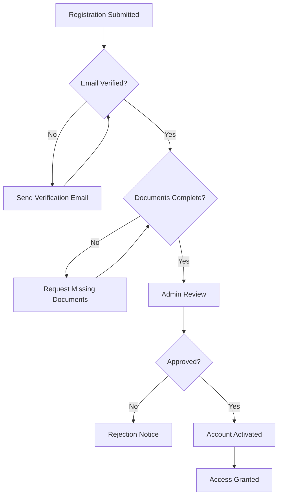

# Government Personnel Verification System

## Overview
The SafePaw platform includes a robust verification system for government officials and animal control personnel to ensure only authorized individuals can access the government portal and take action on incidents.

---

## Verification Process

### 1. Registration
Government personnel must register through an official channel with the following information:

**Required Information:**
- Full Name
- Official Email (government domain)
- Employee ID / Badge Number
- Department / Agency
- Role / Position
- Contact Number
- Jurisdiction / Service Area

**Example:**
```json
{
  "name": "John Doe",
  "email": "john.doe@chennai.gov.in",
  "employeeId": "AC-2024-001",
  "department": "Animal Control Division",
  "role": "Senior Animal Control Officer",
  "phone": "+919876543210",
  "jurisdiction": "North Chennai",
  "verificationStatus": "pending"
}
```

### 2. Document Verification
Personnel must submit the following documents:

- **Government ID Card** (front and back)
- **Official Letter of Authorization** from department head
- **Recent Photograph** (passport size)
- **Proof of Training** (animal control certification)

### 3. Background Check
Automated and manual verification includes:

✅ Email domain verification (must be official government domain)  
✅ Employee ID validation against government database  
✅ Department confirmation  
✅ Training certification verification  
✅ Background clearance check  

### 4. Approval Workflow



---

## Firestore Data Structure

### Collection: `governmentAgents`

```typescript
interface GovernmentAgent {
  // Personal Information
  name: string;
  email: string;
  phone: string;
  employeeId: string;
  
  // Official Details
  department: string;
  role: string;
  jurisdiction: string;
  assignedZone: string;
  
  // Verification
  verificationStatus: 'pending' | 'verified' | 'rejected';
  verifiedBy: string; // Admin ID
  verifiedAt: Timestamp;
  
  // Documents
  documents: {
    idCard: string; // Storage URL
    authorizationLetter: string;
    photo: string;
    certifications: string[];
  };
  
  // Availability
  availability: 'on_duty' | 'off_duty' | 'unavailable';
  shiftStart?: string; // HH:MM format
  shiftEnd?: string;
  
  // Contact Preferences
  contactInfo: {
    phone: string;
    email: string;
    preferredMethod: 'sms' | 'email' | 'both';
  };
  
  // Performance Metrics
  stats: {
    incidentsHandled: number;
    averageResponseTime: number; // in hours
    successRate: number; // percentage
  };
  
  // Metadata
  createdAt: Timestamp;
  updatedAt: Timestamp;
  lastActive: Timestamp;
  status: 'active' | 'suspended' | 'inactive';
}
```

---

## Verification Levels

### Level 1: Basic Verification
- Email verification
- Phone number verification
- Basic profile completion

**Access:** Read-only access to incidents

### Level 2: Document Verification
- Government ID verified
- Department confirmation
- Authorization letter approved

**Access:** Can view and comment on incidents

### Level 3: Full Verification
- All documents approved
- Background check completed
- Training certification verified
- Admin approval granted

**Access:** Full access - can take action, update status, assign resources

---

## Security Features

### 1. Two-Factor Authentication (2FA)
All verified government personnel must enable 2FA:
- SMS-based OTP
- Authenticator app (Google Authenticator, Authy)
- Email verification code

### 2. Session Management
- Session timeout: 30 minutes of inactivity
- Concurrent session limit: 2 devices
- IP address logging
- Device fingerprinting

### 3. Audit Trail
Every action is logged:
```typescript
{
  agentId: string;
  action: string;
  incidentId?: string;
  timestamp: Timestamp;
  ipAddress: string;
  deviceInfo: string;
  result: 'success' | 'failure';
}
```

### 4. Role-Based Access Control (RBAC)

| Role | Permissions |
|------|------------|
| **Viewer** | View incidents only |
| **Responder** | View, comment, update status |
| **Coordinator** | All responder + assign resources |
| **Supervisor** | All coordinator + approve escalations |
| **Admin** | Full system access + user management |

---

## API Endpoints

### Verify Government Agent
```typescript
POST /api/verifyAgent
{
  "agentId": "string",
  "verificationStatus": "verified" | "rejected",
  "verifiedBy": "adminId",
  "notes": "string"
}
```

### Update Availability
```typescript
PUT /api/agents/:agentId/availability
{
  "availability": "on_duty" | "off_duty",
  "shiftStart": "09:00",
  "shiftEnd": "17:00"
}
```

### Get Available Agents
```typescript
GET /api/agents/available?jurisdiction=North Chennai
Response: GovernmentAgent[]
```

---

## Verification Workflow Implementation

### Cloud Function: `verifyGovernmentAgent`

```typescript
export const verifyGovernmentAgent = onCall(async (request) => {
  const { agentId, status, verifiedBy } = request.data;
  
  // Verify admin permissions
  const admin = await getAdmin(verifiedBy);
  if (!admin.hasPermission('verify_agents')) {
    throw new Error('Unauthorized');
  }
  
  // Update agent status
  await db.collection('governmentAgents').doc(agentId).update({
    verificationStatus: status,
    verifiedBy,
    verifiedAt: FieldValue.serverTimestamp(),
    status: status === 'verified' ? 'active' : 'inactive'
  });
  
  // Send notification
  if (status === 'verified') {
    await sendVerificationSuccessEmail(agentId);
  } else {
    await sendVerificationRejectionEmail(agentId);
  }
  
  return { success: true };
});
```

---

## Testing Verification System

### 1. Create Test Government Agent
```bash
# In Firestore Console
Collection: governmentAgents
Document ID: auto-generate

Data:
{
  "name": "Test Officer",
  "email": "test.officer@chennai.gov.in",
  "employeeId": "TEST-001",
  "department": "Animal Control",
  "role": "Officer",
  "jurisdiction": "Chennai",
  "verificationStatus": "pending",
  "availability": "on_duty",
  "contactInfo": {
    "phone": "+919876543210",
    "email": "test.officer@chennai.gov.in",
    "preferredMethod": "both"
  },
  "createdAt": "2025-12-28T00:00:00Z"
}
```

### 2. Test Verification Flow
1. Register as government personnel
2. Upload verification documents
3. Admin reviews and approves
4. Receive verification email
5. Login with verified account
6. Access government portal

---

## Best Practices

### For Government Agencies
✅ Use official government email domains only  
✅ Maintain updated employee databases  
✅ Regular training on system usage  
✅ Periodic re-verification (every 6 months)  
✅ Immediate deactivation of former employees  

### For System Administrators
✅ Review verification requests within 24 hours  
✅ Verify documents against official databases  
✅ Monitor for suspicious activity  
✅ Regular security audits  
✅ Keep audit logs for minimum 1 year  

### For Developers
✅ Never store sensitive documents in plain text  
✅ Encrypt all personal information  
✅ Implement rate limiting on verification endpoints  
✅ Use secure file upload with virus scanning  
✅ Regular security updates and patches  

---

## Compliance & Legal

### Data Protection
- All personal data encrypted at rest and in transit
- GDPR/local data protection law compliance
- Right to access and delete personal data
- Data retention policy: 2 years after account closure

### Audit Requirements
- All verification decisions logged
- Document retention for legal compliance
- Regular compliance audits
- Incident reporting to authorities

---

## Support & Contact

For verification issues:
- **Email:** verification@safepaw.gov.in
- **Phone:** +91-XXX-XXX-XXXX
- **Portal:** https://safepaw.app/government/support
- **Response Time:** Within 24 hours

---

## Future Enhancements

🔮 **Planned Features:**
- Biometric verification (fingerprint/face recognition)
- Integration with national ID databases
- Automated background check APIs
- Mobile app for field verification
- Real-time availability tracking
- Performance analytics dashboard
